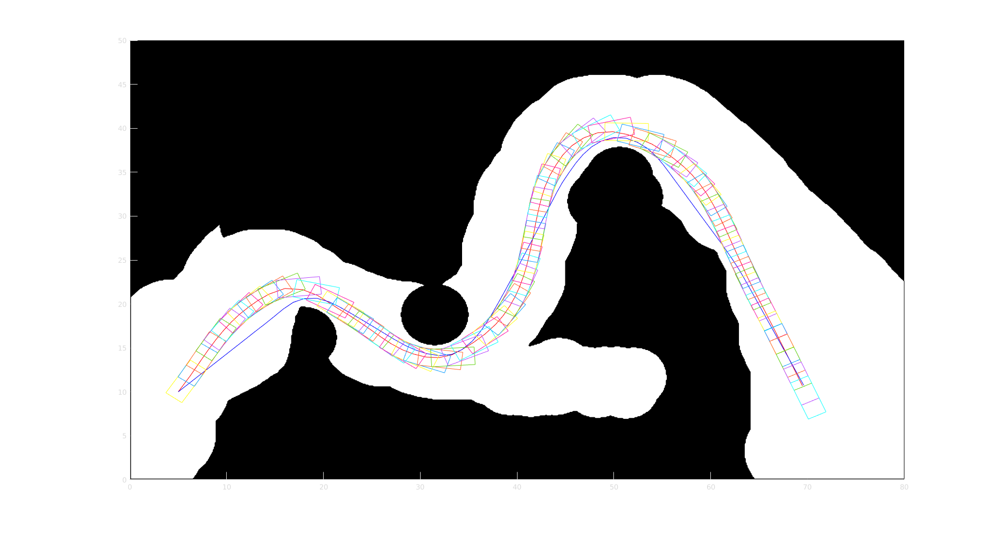

# Description
This is my primary attempt about trajectory optimization. 

## trajectory generation
Trajectory generation problem is usually as the two-point boundry value problem(TPBVP), which generates a smooth and kinematic-feasible path connected the given initial state and goal state. It's the most important part of state-sampling based path planning method, which selects the optimal one from lots of candidate trajectories. Here we use Bspline to represent trajectory and employ the collocation method to transform original TPBVP as nonlinear programming program. The complete introduce refers to this paper "[Real-Time Trajectory Generation for Constrained Nonlinear Dynamical Systems Using
Non-Uniform Rational B-spline Basis Functions](http://www.cds.caltech.edu/~murray/preprints/mef07-phd.pdf)". The following picture shows the result trajectories with different goal state.

## Frenet-based trajectory optimization
This method is inspired by this paper "[Trajectory Planning Under Vehicle Dimension Constraints Using Sequential Linear Programming](http://cse.lab.imtlucca.it/~bemporad/publications/papers/itsc17-traj_planning.pdf)". Here we employ nonlinear programming to do the low-level implementation shown as following pictures.

The key of this method is to input a high-quality curvature continuity reference path to establish the frenet coordinate. In this example, the reference path(the blue curve) is generated by a space exploration process explained in "[Hybrid Trajectory Planning for Autonomous Driving in Highly Constrained Environments](https://ieeexplore.ieee.org/abstract/document/8375948)"